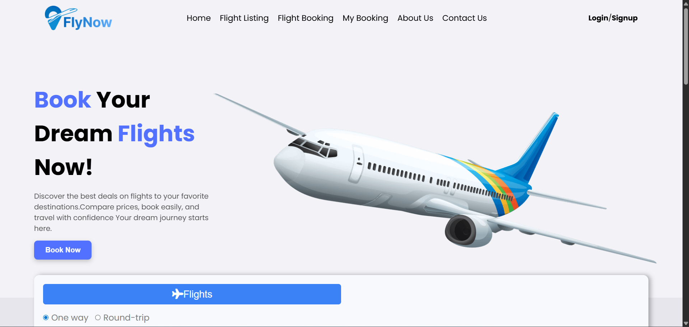

# ✈️ FlyNow

FlyNow is a **responsive airline ticket booking website** built with **HTML, CSS, JavaScript**, and popular libraries.  
It provides an easy-to-use interface for **flight search, booking, and managing reservations** with a **modern UI** and **mobile-friendly layout**.  

 Live Demo: [FlyNow on Vercel](https://fly-now-ebon.vercel.app/)

---

## 🚀 Features
- 🛫 **Flight Listing & Ticket Booking**  
- 📑 **My Booking Page** to view reservations  
- ℹ️ **About Us Section** with company details  
- 📩 **Contact Page** with working form  
- 🎨 **Responsive Design with Animations**  
- 🔔 **Alerts & Smooth Scroll Effects**  

---

## 🛠️ Tech Stack
- **Frontend:** HTML, CSS, JavaScript  
- **Libraries/Plugins:**  
  - [AOS] – Scroll animations  
  - [SweetAlert] – Stylish alert dialogs  
  - [FontAwesome] – Icons   

---

## 📂 Project Structure
Flynow/
├── index.html # Homepage (flight search/listing)
├── about.html # About page
├── contact.html # Contact page with form
├── service.html # Services section
├── join.html # Join Us page with form
├── my-booking.html # My Bookings page
├── css/ # Stylesheets
├── js/ # JavaScript logic
├── images/ # Assets (icons, backgrounds, etc.)
└── README.md

---

## 📸 Screenshots

###  Homepage

---

## 📬 Contact
Created by **[Ayush Rusiya](https://github.com/ayushrusiya9)** ✨  
Feel free to reach out for feedback or suggestions!